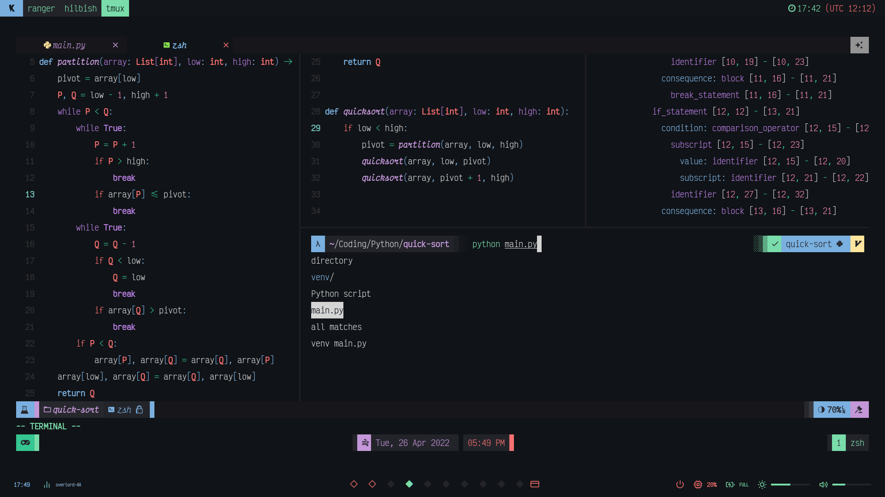
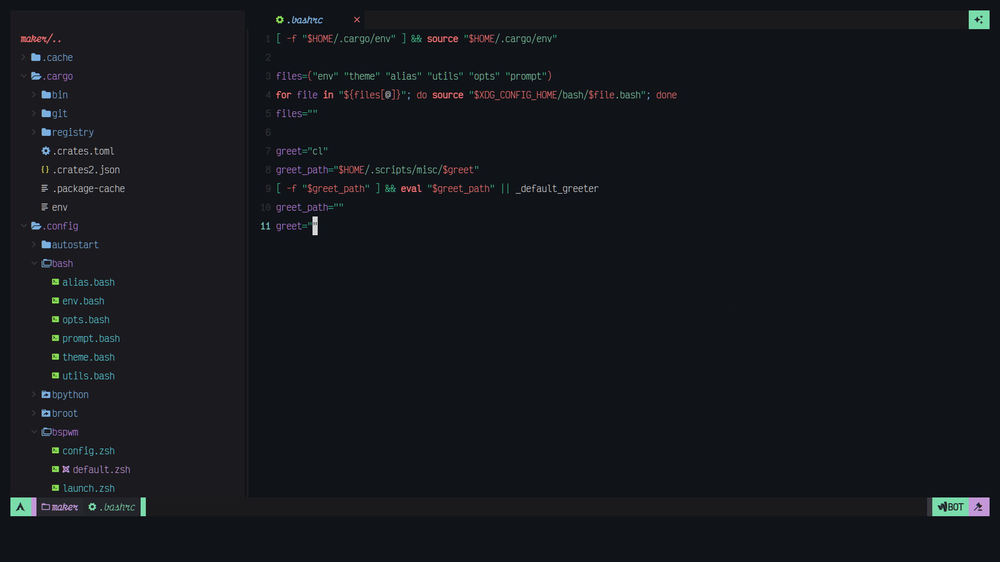
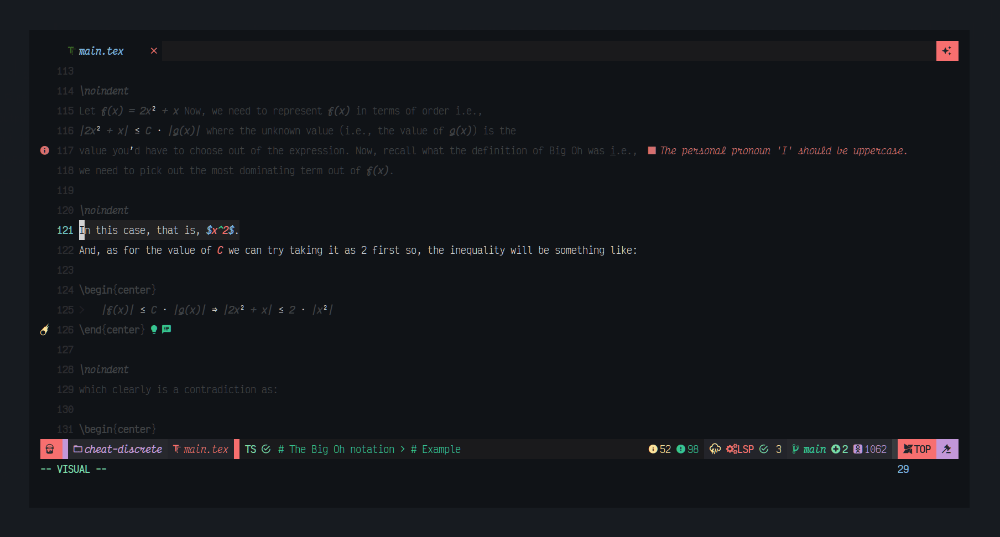
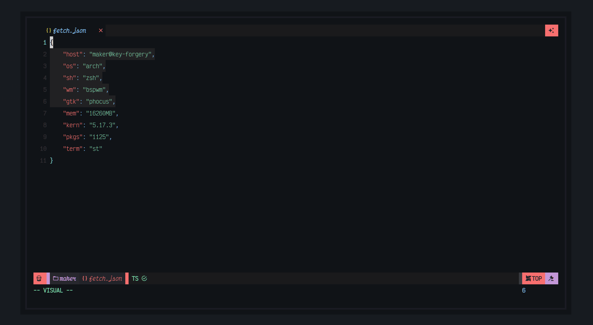
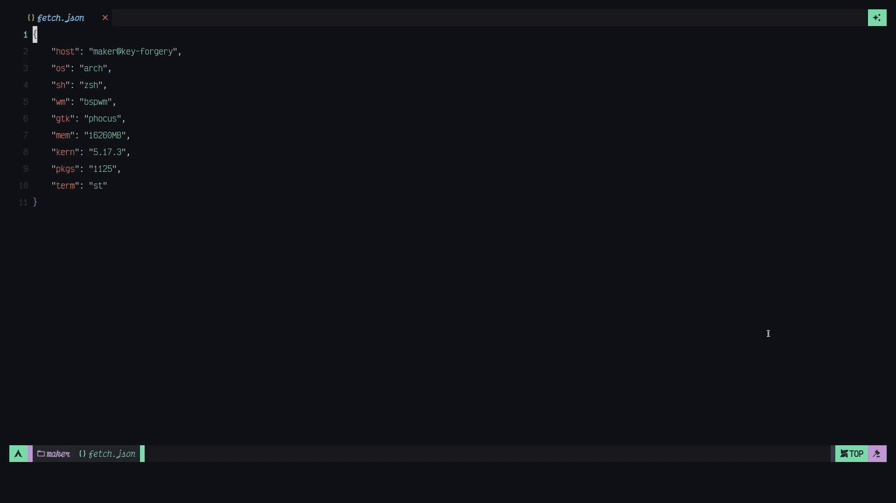
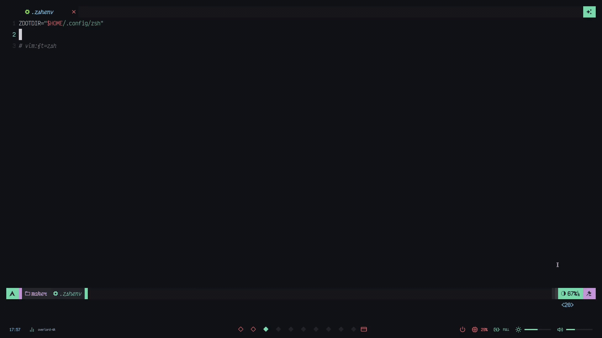
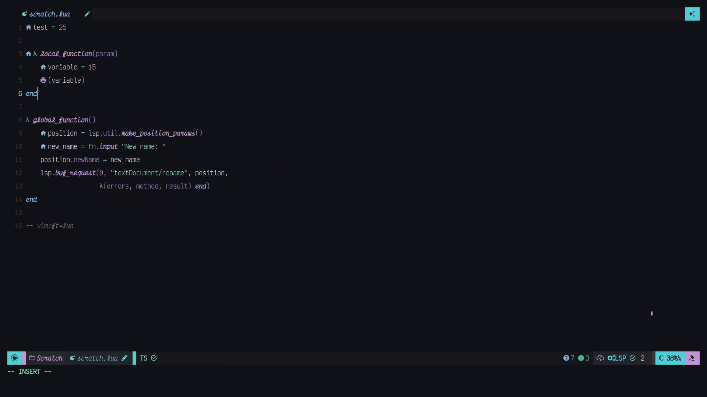

<div align="center">

# nvim-config


<!--  -->

```txt
---Startuptime---
037.291 (avg) with [160 Plugs]
020.133 (avg) with [40 Plugs]
```

</div>

## Installation

Well, there isn't much of an installation procedure for this. You would
clone this and open neovim.
Anyway, for the sake of it, I will provide you with some installation instructions.

```sh
git clone --depth 1 https://github.com/dharmx/KrakeNvim.git ~/.config/nvim
nvim
```

You can use symbolic links as well.

```sh
git clone --depth 1 https://github.com/dharmx/nvim-config.git ~/Dotfiles/KrakeNvim
ln -s ~/Dotfiles/KrakeNvim ~/.config/nvim
nvim
```

### Few caveats
- Restarting Neovim once or, twice might be necessary after initial install.
- Restarting Neovim after `:TSStart` might be necessary.
- Restarting Neovim after `:LspStart` might be necessary.

## Requirements

- Neovim version v0.8.0
- A functioning brain

## Keybindings

The following are some notable default mappings that come with my config.

### LSP

These are lazy-loaded meaning, these mappings will
only take effect if an LSP client is attached.

| **Keybind**    | **Action**                                                                                                                 |
|----------------|----------------------------------------------------------------------------------------------------------------------------|
| `<Leader>lbK`  | Hover Documentation.                                                                                                       |
| `<Leader>lbc`  | Code Actions.                                                                                                              |
| `<Leader>lbf`  | Format current buffer synchronously.                                                                                       |
| `<Leader>lbF`  | Format current buffer by sequentially requesting LSP clients.                                                              |
| `<Leader>lbff` | Format current buffer.                                                                                                     |
| `<Leader>lbr`  | Rename item be it variable, dictionary key, etc. Changes will be applied to all of its referenced, even in multiple files. |
| `<Leader>lbT`  | Toggles auto-formatting for the current buffer. **[unstable]**                                                             |
| `<Leader>lde`  | Show current diagnostics in a floating buffer.                                                                             |
| `<Leader>ld[`  | Go to the nearest error before the current line.                                                                           |
| `<Leader>ld]`  | Go to the nearest error after the current line.                                                                            |
| `<Leader>ldq`  | Sets loclist.                                                                                                              |
| `<Leader>lgD`  | Jumps to the declaration of symbol under the cursor.                                                                       |
| `<Leader>lgd`  | Jumps to the definition of the symbol under the cursor.                                                                    |
| `<Leader>lgs`  | See the signature of a symbol under the cursor.                                                                            |
| `<Leader>lgi`  | Lists all the implementations for the symbol under the cursor.                                                             |
| `<Leader>lgt`  | Jumps to the definition of the type of the symbol under the cursor.                                                        |
| `<Leader>lgr`  | Lists all the references to the symbol under the cursor.                                                                   |
| `<Leader>lgc`  | Removes document highlights from current buffer.                                                                           |
| `<Leader>lwa`  | Add the folder at path to the workspace folders.                                                                           |
| `<Leader>lwr`  | Remove the folder at path to the workspace folders.                                                                        |
| `<Leader>lwl`  | View workspace folder. **[needs an ui]**                                                                                   |

### LSP `nvim-jdtls`

These will only take effect if the plugin `nvim-jdtls` is loaded.

| **Keybind**  | **Actions**             |
|--------------|-------------------------|
| `<Leader>lc` | Compile all Java files. |
| `<Leader>lr` | Set Java runtime.       |
| `<Leader>lu` | Update project config.  |
| `<Leader>lj` | JOL.                    |
| `<Leader>lb` | View bytecode.          |
| `<Leader>ls` | Open JShell REPL.       |
| `<Leader>lo` | Organize imports.       |
| `<Leader>lv` | Extract variable.       |
| `<Leader>lk` | Extract constant.       |
| `<Leader>lV` | Extract variable true.  |
| `<Leader>lK` | Extract constant true.  |
| `<Leader>lM` | Extract method.         |

### Telescope

Coming soon... (there's a lot)

### Pandoc

| **Keybind** | **Action**     |
|-------------|----------------|
| `<Leader>j` | Render.        |
| `<Leader>b` | Build.         |
| `<Leader>e` | Show equation. |

### Terminals and REPLs

| **Keybind**  | **Action**                              |
|--------------|-----------------------------------------|
| `<Leader>/n` | Open node REPL.                         |
| `<Leader>/t` | Open BTOP system monitor.               |
| `<Leader>/p` | Open python REPL.                       |
| `<Leader>/b` | Open bpython REPL.                      |
| `<Leader>/y` | Open pypy REPL.                         |
| `<Leader>/x` | Open fish shell.                        |
| `<Leader>/k` | Open bash shell.                        |
| `<Leader>/z` | Open zsh shell.                         |
| `<Leader>/i` | Open posix shell.                       |
| `<Leader>/r` | Open ranger file manager.               |
| `<Leader>/l` | Open lua REPL.                          |
| `<Leader>/j` | Open jshell REPL.                       |
| `<Leader>/g` | Open groovy REPL.                       |
| `<Leader>/c` | Open bluetoothctl console.              |
| `<Leader>/m` | Open hilbish shell.                     |
| `<Leader>/f` | Open `toggleterm` in float window.      |
| `<Leader>/h` | Open `toggleterm` in horizontal buffer. |
| `<Leader>/v` | Open `toggleterm` in vertical buffer.   |

### Plugin management by `packer.nvim`

| **Keybind**  | **Action**                                                              |
|--------------|-------------------------------------------------------------------------|
| `<Leader>ps` | Status of all installed plugins.                                        |
| `<Leader>pu` | Update all installed plugins but, don't generate plugin specifications. |
| `<Leader>pi` | Install all missing plugins that exists in plug-config.                 |
| `<Leader>pc` | Clean all plugins that are removed from plug-config.                    |
| `<Leader>pr` | Re-compile / Generate plugin specification file.                        |
| `<Leader>pf` | Show `packer.nvim` profile data.                                        |

### Mode replacements

| **Keybind** | **Action**                                |
|--------------|----------------------------------------------------------------|
| `<Leader>Ms` | Use VSCode style search prompt.                                |
| `<Leader>Mr` | Use VSCode style find and replace prompt.                      |
| `<Leader>Ml` | Clear search highlights. Same as `<Esc>`.                      |
| `<Leader>Mm` | Use VSCode style find all prompt.                              |
| `<Leader>Mi` | Use VSCode style insert-search.                                |
| `<Leader>Mc` | Use GUI style CMDLine prompt `(appears middle of the window)`. |
| `<Leader>MS` | Redirect all `/` search mode inputs to an `nui.nvim` backend.  |
| `<Leader>MC` | Redirect all `:` cmdline mode inputs to an `nui.nvim` backend. |

### Launchers and Color illustrators

| **Keybind**     | **Action**  |
|-----------------|-----------------------------------------------------------------------------|
| `<Leader>l<CR>` | Starts the LSP server.                                                      |
| `<Leader>T`     | Starts the TreeSitter plugin.                                               |
| `<Leader>L`     | Starts LSP, TS and loads Telescope all at once.                             |
| `<F3>`          | Enables colorizer so to get a visual representation of the hex color codes. |
| `<Leader>k<F1>` | Same as `<F3>` but this one supports HSL, ANSI, RGB, etc.                     |

### Git

| **Keybind**         | **Action**                                       |
|---------------------|--------------------------------------------------|
| `<Leader><Leader>j` | Next Git Hunk                                    |
| `<Leader><Leader>k` | Previous Git Hunk                                |
| `<Leader><Leader>h` | Highlights Git number column                     |
| `<Leader><Leader>d` | Shows Git Diff                                   |
| `<Leader><Leader>L` | Opens up `lazygit` in a floating terminal buffer |

### Buffers and Tabs

| **Keybind**            | **Action**                                         |
|--------------------|------------------------------------------------|
| `<Leader>bi`       | Pick a buffer.                                 |
| `<Leader>bn`       | Swap the current buffer with the next one.     |
| `<Leader>bp`       | Swap the current buffer with the previous one. |
| `<Leader>bl`       | Close all buffers that're to the left.        |
| `<Leader>br`       | Close all buffers that're to the right.       |
| `<Leader>bx`       | Pick a buffer and close it.                    |
| `<Leader>bsd`      | Sort buffers by directory.                     |
| `<Leader>bst`      | Sort buffers by tabs.                          |
| `<Leader>bse`      | Sort buffers by file extension.                |
| `<Leader>bsr`      | Sort buffers by relative directory.            |
| `<Leader>b={0..9}` | Go to buffer number `{0..9}`.                    |
| `<Tab>`            | Cycle to the next buffer.                      |
| `<S-Tab>`          | Cycle to the previous buffer.                  |
| `<C-t>`            | Create an empty tab.                           |
| `<C-b>`            | Create a new buffer.                           |
| `<Leader>q`        | Delete the current buffer.                     |
| `<Leader>Bh`       | Go to the last tab.                            |
| `<Leader>Bl`       | Go to the first tab.                           |
| `<Leader>k`        | Close all tabs except the current.             |
| `<Leader>bj`       | Same as `<Leader>Bh`                           |

### Primary / UI-related

| **Keybind**  | **Action**                                  |
|--------------|---------------------------------------------|
| `<F9>`       | Bookmark current line.                      |
| `<C-n>`      | Open file tree explorer.                    |
| `<F5>`       | Open ranger file explorer.                  |
| `<Leader>us` | Toggle the statusline.                      |
| `<Leader>ur` | Toggle relative number column.              |
| `<Leader>n`  | Toggle number column.                       |
| `<Leader>t`  | Toggle tabline.                             |
| `<C-w>`      | Save current buffer.                        |
| `\|<C-\>`    | Open built-in terminal in vertical split.   |
| `-<C-\>`     | Open built-in terminal in horizontal split. |
| `<Leader>v`  | Vertical split current buffer.              |
| `<Leader>h`  | Horizontal split current buffer.            |
| `<Leader>V`  | Vertical split and create a new buffer.     |
| `<Leader>H`  | Horizontal split and create a new buffer.   |
| `<Esc>`      | Remove search highlights.                   |
| `<C-y>`      | Copy all text into the clipboard.           |
| `<F2>`       | Toggle built-in spellcheck.                 |

### Music

| **Keybind**  | **Action**                                |
|--------------|-------------------------------------------|
| `<Leader>sn` | Spotify: Skip current track.              |
| `<Leader>sp` | Spotify: Pause current track.             |
| `<Leader>ss` | Spotify: Add current track to liked list. |
| `<Leader>so` | Spotify: Start spotify.                   |
| `<Leader>sd` | Spotify: Show connected devices.          |
| `<Leader>sb` | Spotify: Cycle to next track.             |

### Nice-to-have

| **Keybind**  | **Actions**                  |
|--------------|------------------------------|
| `<C-i><C-l>` | URL Shortner by `is.gd`      |
| `<C-i><C-i>` | Image hosting by `imgur.com` |
| `<C-i><C-p>` | Text hosting by `dpaste.com` |

<!-- ## Statusline -->

<!-- Coming soon... (there's a lot) -->

<!-- ## Debuggers -->

<!-- Coming soon... -->

<!-- ## Showcase -->

<!-- Following are various screenshots of this configuration is action. Enjoy! -->

<!-- ### nvim-tree.lua -->

<!--  -->

<!-- ### which-key.nvim -->

<!--  -->

<!-- ### SymbolsOutline.nvim -->

<!--  -->

<!-- ### Completion by nvim-cmp -->

<!--  -->

<!-- ### `vim.notify` backend by nvim-notify -->

<!--  -->

<!-- ### Focus with twilight.nvim -->

<!--  -->

<!-- ### FZF though git, files, clipboards, etc using telescope.nvim -->

<!--  -->

<!-- ### Edit without any distractions using TruZen.nvim -->

<!--  -->

<!-- ### Brightness control in Neovim -->

<!--  -->

<!-- ### Treesitter playground extension -->

<!--  -->

<!-- ### Toggle terminals -->

<!--  -->

<!-- ### URL Shortner -->

<!--  -->

<!-- ### Code file host -->

<!--  -->

<!-- ### Read, Write and Change reference highlights -->

<!--  -->

<!-- ### `:` cmdline and `/` search mode override -->

<!--  -->

<!-- ### Autopairs -->

<!--  -->

<!-- ### LSP show diagnostics in normal mode -->

<!--  -->

<!-- https://nvimluau.dev/ -->

## To-dos

Following are the current goals of this repository.

- [ ] Add `telescope.nvim` keybinding readme section.
- [x] Add comments and documentations.
- [x] Remove code-duplication and other refactoring.
- [x] Fix LSP module for statusline.
- [x] Add more colorschemes
- [ ] Revise keybindings
- [ ] Add `legend.nvim`
- [ ] Configure `hop.nvim`, `leap.nvim` and `lightspeed.nvim`
- [x] Migrate to Telescope config the newest version.
- [ ] Configure debuggers `nvim-dap`
- [ ] Add some custom `treesitter` queries.
- [ ] Add keybindings for interfacing with MPD.
- [ ] Add better blacklisting for statusline.
- [ ] Rewrite statusline.
- [x] Do not use global aliases. Eliminate the need of `aliases.lua`.
- [ ] Revise documentations, code, readme, colorschemes and keybindings.
- [x] STL background doesn't change when colorscheme is changed.
- [x] Write benchmarks.
- [ ] Write tests.
- [ ] Rewrite and re-plan if shit goes out of hand.

## Goals

Following are the points that this repository strives to be.

- Overload with features.
- Turn Neovim into a JetBrains-like IDE.

## Not goals

Following are the points that this repository doesn't strive to be.

- Will not add importance on speed.
- No config file will be added.
- Not a neovim distro.
- Won't be stable, ever.
- The amount of plugins will decrease only if it is not maintained.

---

<div align="center">

## License

This project is licensed under [GPL--3.0](./LICENSE.txt).

</div>

<!--
  vim:ft=markdown
-->
