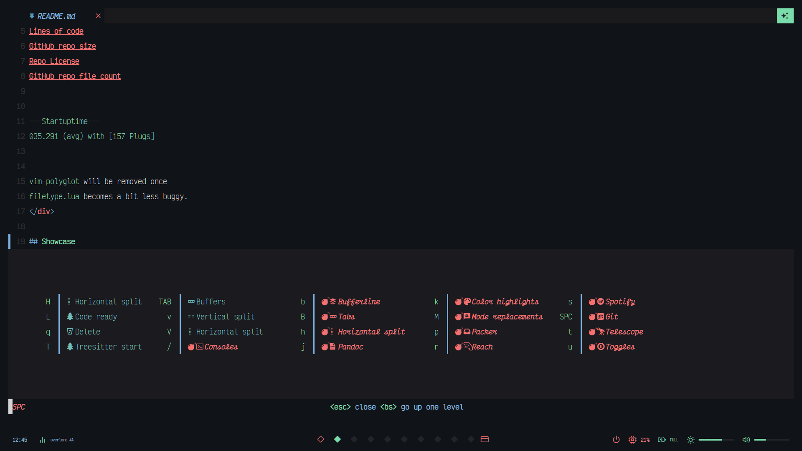
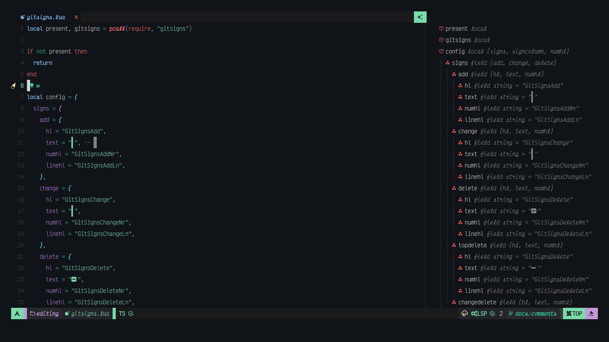
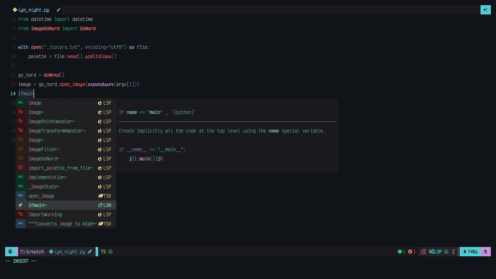
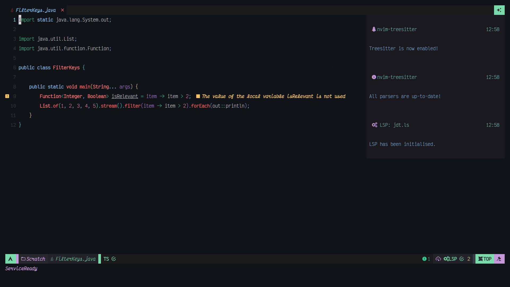
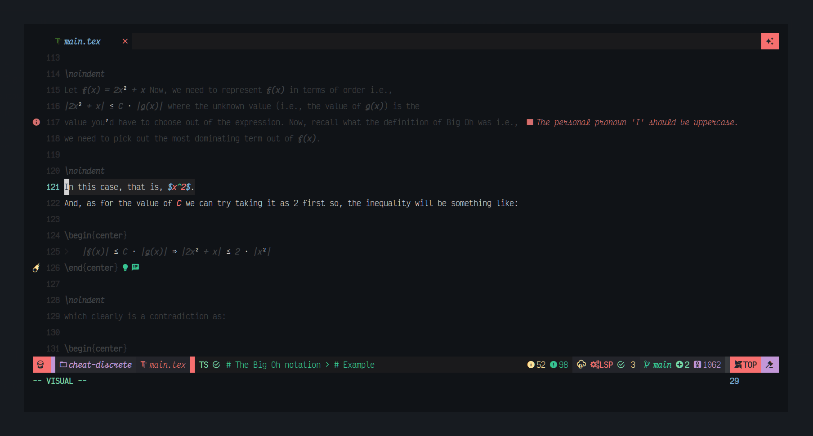
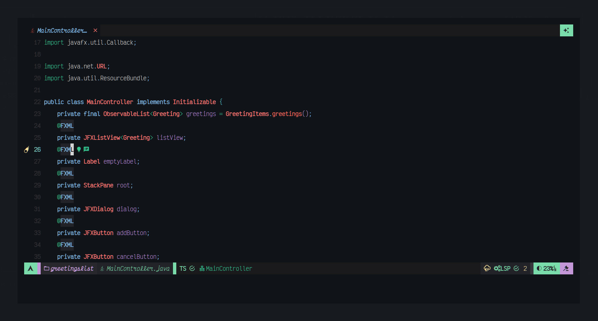
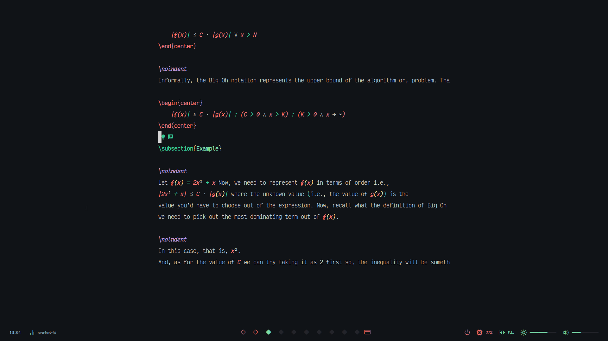
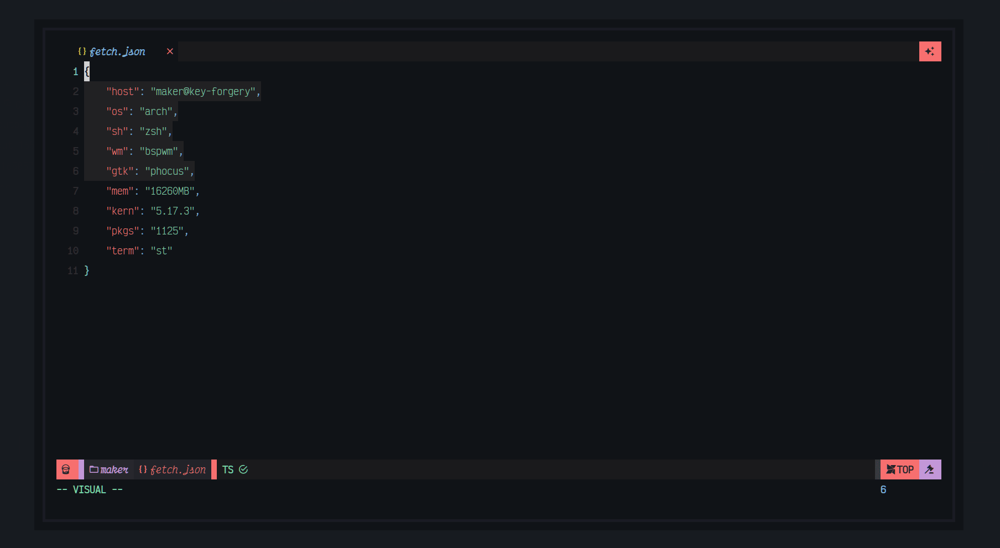
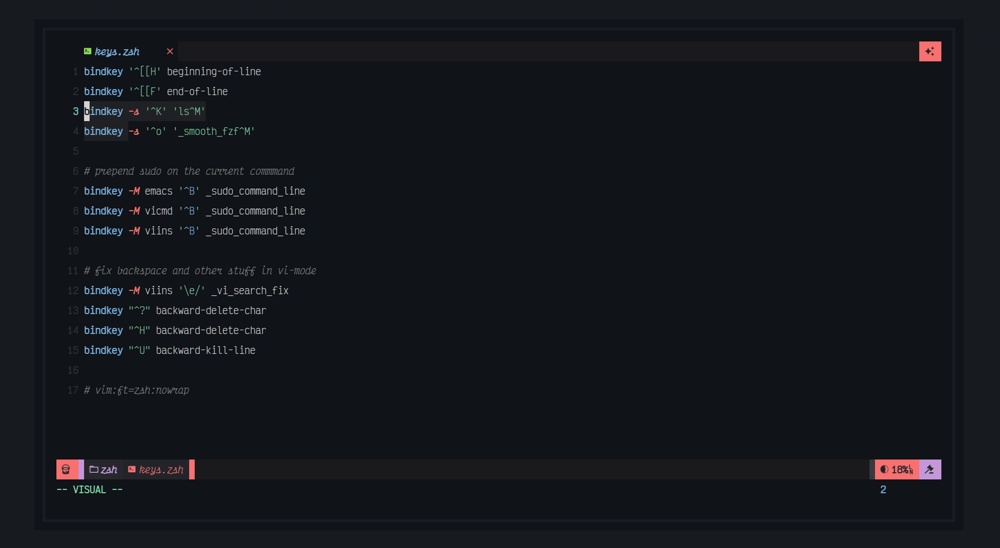
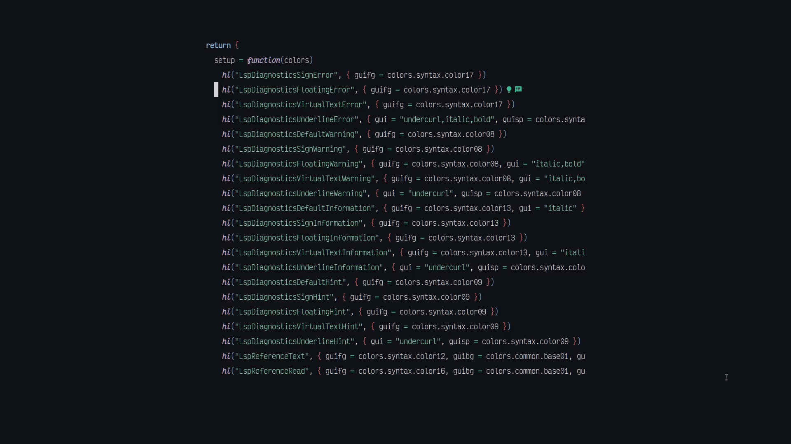

<div align="center">

# nvim-config


```txt
---Startuptime---
035.291 (avg) with [157 Plugs]
```

`vim-polyglot` will be removed once
`filetype.lua` becomes a bit less buggy.
</div>

## Installation 
Coming soon...

## Keybindings
Coming soom...

## Statusline
Coming soon...

## Showcase
Following are various screenshots of this configuration is action. Enjoy!

## Debuggers
Coming soon...

### nvim-tree.lua
 

### which-key.nvim
 

### SymbolsOutline.nvim


### Completion by nvim-cmp


### `vim.notify` backend by nvim-notify


### Focus with twilight.nvim


### FZF though git, files, clipboards, etc using telescope.nvim


### Edit without any distractions using TruZen.nvim


### Brightness control in Neovim


### Treesitter playground extension


### Toggle terminals
 

### URL Shortner
 

### Code file host
 

### Read, Write and Change reference highlights
 

More coming soon...

## Todos
Coming soon...

## End goals
Coming soon...

## Not goals
Coming soon...

---

<div align="center">

## License
This project is licensed under [GPL--3.0](./LICENSE.txt).

</div>

<!--
  vim:ft=markdown
-->
